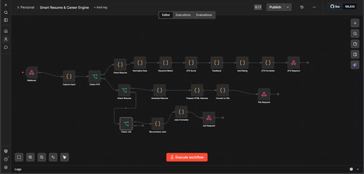
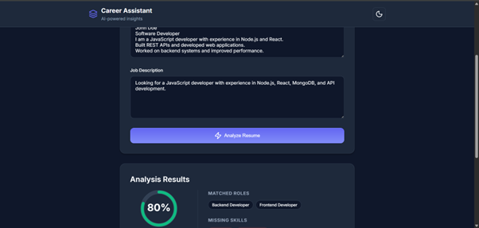
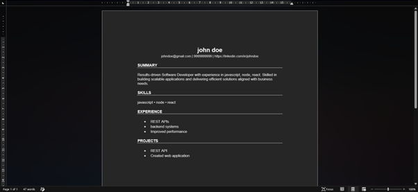
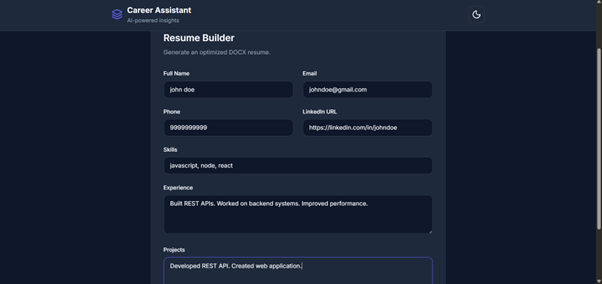
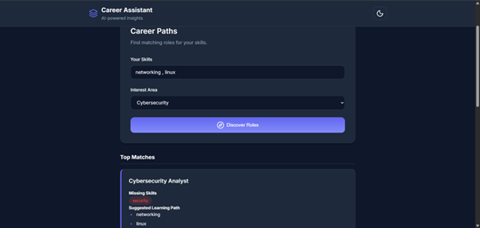

# Smart Resume & Career Engine

An AI-powered career development platform that helps users evaluate resume quality, analyze ATS compatibility, generate professional resumes, and discover career opportunities aligned with their skills and interests.

---

## Overview

Modern hiring processes rely heavily on Applicant Tracking Systems (ATS), making resume optimization and skill alignment increasingly important.

Smart Resume & Career Engine automates resume analysis, evaluates job compatibility, generates structured resumes, and provides intelligent career recommendations to help candidates improve their professional profiles and identify suitable opportunities.

---

## Key Features

- ATS compatibility analysis
- Resume evaluation and scoring
- Missing skill identification
- Professional resume generation
- Career path recommendations
- Role matching based on skills
- Automated career insights
- Structured profile assessment

---

## Workflow Design

The workflow processes user information through multiple automated stages:

1. Capture user profile and resume data
2. Extract relevant skills and experience
3. Analyze ATS compatibility
4. Evaluate keyword alignment
5. Generate resume recommendations
6. Create structured resume output
7. Recommend suitable career paths

### Workflow Architecture

---

## ATS Analysis

The platform evaluates resume content and determines how effectively it aligns with modern Applicant Tracking System requirements.

Analysis includes:

- Keyword relevance
- Skill matching
- Resume structure evaluation
- Role compatibility
- Content optimization opportunities

### ATS Score Output

---

## Resume Generation

The system automatically generates a structured professional resume using the provided skills, experience, and project information.

Benefits include:

- Consistent formatting
- Professional presentation
- ATS-friendly structure
- Organized skill representation

### Resume Generation Output

---

## Resume Builder

Users can create professional resumes by providing their background information, technical skills, projects, and experience.

### Resume Builder Interface

---

## Career Recommendations

The recommendation engine identifies suitable career paths by evaluating skill alignment and user interests.

Possible recommendation categories include:

- Primary career matches
- Adjacent opportunities
- Aspirational career paths
- Skill development recommendations

### Job Recommendation Output

---

## Benefits

### Improved ATS Performance

Helps users identify missing keywords and improve resume visibility during automated screening.

### Career Guidance

Provides structured recommendations based on existing skills and interests.

### Faster Resume Creation

Reduces the effort required to create professional and organized resumes.

### Better Job Alignment

Highlights career opportunities that match the user's current profile and capabilities.

### Skill Development Insights

Identifies areas where additional learning may improve career opportunities.

---

## Technology Stack

- n8n Workflow Automation
- JavaScript
- AI Language Models
- Resume Analysis Systems
- ATS Evaluation Logic
- Automated Recommendation Engine

---

## Use Cases

- Resume Optimization
- Career Planning
- Job Readiness Assessment
- ATS Compatibility Evaluation
- Professional Resume Creation
- Skill Gap Identification
- Career Path Discovery

---

## Project Highlights

- Designed an end-to-end career assistance workflow
- Automated ATS analysis and scoring
- Built intelligent career recommendation functionality
- Created automated resume generation workflows
- Developed structured candidate evaluation processes
- Improved resume optimization and career discovery experience

---

## Future Enhancements

- LinkedIn profile analysis
- Industry-specific resume optimization
- Interview preparation assistance
- Advanced skill gap analysis
- Personalized learning recommendations
- Real-time job market insights

---

## Author

Developed as an AI and automation project focused on resume intelligence, career guidance, ATS optimization, and professional development workflows.
